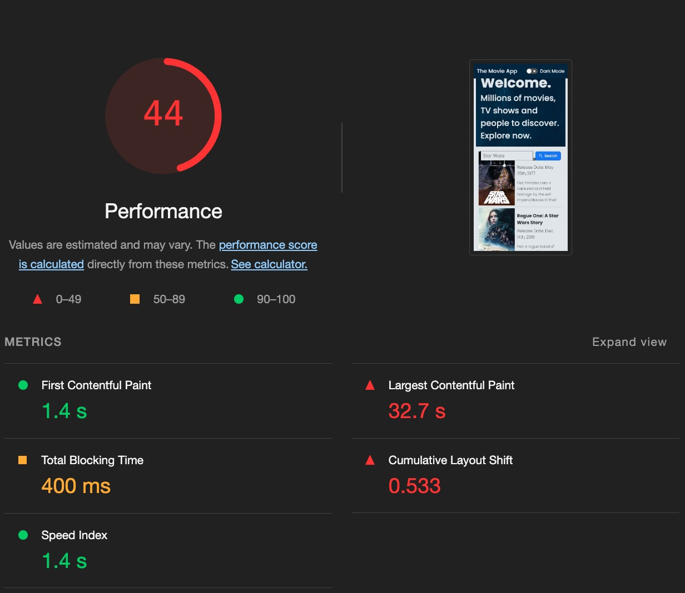
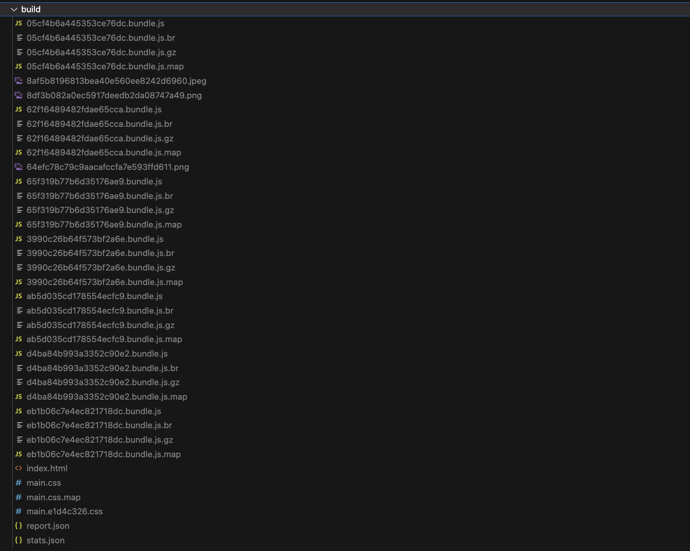
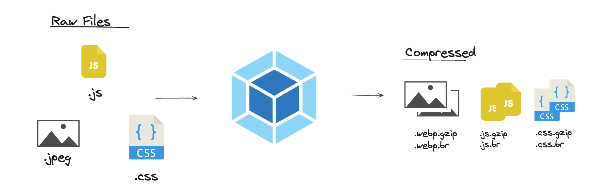

# Action Item: Web Performance 🚀

In this Action Item, you will:

- 🚦 Use `Lighthouse` to diagnose performance problems in our application
- 📡 Setup `Sentry` to monitor the web performance users' experience
- 🔬 Understand our bundle with the `bundle analyzer`
- 🧠 Optimize performance using: `code splitting`, `lazy loading`, `compression`, `dynamic imports` and `minification` among others


We will start with our rather slow Movie app and get the Performance score to **100%**:


## 🚀 Challenges

### 1. Diagnosis

- [x] 1. **🟢 EASY** Run a `Lighthouse` diagnosis on your local machine
- [ ] 2. **🟢 EASY** Setup `Sentry` to monitor the `Core Web Vitals` in `production`
- [ ] 3. **🟢 EASY** 🎁 Bonus: Extract the `Critical Rendering Path` with `Performance Insights`

### 2. Static Assets Optimization - `CSS`, `Images` & `Fonts`

- [ ] 1. **🟡 MEDIUM** Server Optimization
- [ ] 2. **🟡 MEDIUM** Preparation: Split the `Webpack` configuration to be environment-specific
- [ ] 3. **🟡 MEDIUM** Static Images Optimization with Webpack
- [ ] 4. **🟡 MEDIUM** Optimize Server Images
- [ ] 5. **🟡 MEDIUM** Fonts Optimization with Webpack
- [ ] 6. **🟡 MEDIUM** CSS Optimization with Webpack
- [ ] 7. **🟡 MEDIUM** Final Image Optimization - Image Resize

### 3. JavaScript Optimization

- [ ] 1. **🟢 EASY** JavaScript Bundle Analysis with Webpack
- [ ] 2. **🟢 EASY** Bundle Cleaning: Remove unused dependencies
- [ ] 3. **🟡 MEDIUM** Replace heavy libraries with Vanilla JS Implementations
- [ ] 4. **🔴 HARD** Bundle Splitting, Lazy Loading and Dynamic Imports
- [ ] 5. **🟡 MEDIUM** Minification, Uglification and Compression for JavaScript
- [ ] 6. **🔴 HARD** Aggressive Bundle Cleaning

### 4. Framework Specific Optimization - `React`

- [ ] 1. **🔴 HARD** Fixing the CLS by adding placeholders
- [ ] 2. **🔴 HARD** Optimize re-renders with `React.memo`, `useCallback` and `useMemo`

### 5. OPTIONAL
- [ ] 1. **🔴 EXPERT** Migrate the application to Next.js 🔥

### Getting Started 🚀

1. You will need an `API Key`🔑 to make the requests to the `MoviesAPI`. You can get one [here](https://developers.themoviedb.org/3/getting-started/introduction).
2. Copy the `.env.example` file into a new `.env` file and add your `API Key` there. Your `.env` file should look something like this:

```bash
API_KEY=affc0edf3f789f9357f1d525ba2cdn23
```

3. Check `package.json` to see the scripts available.

- 🚀 Run `npm run dev` to run the app.
- ✅ Run `npm test` to run the `unit tests`.
- 🌐 Run `npm run cy:run` to run the `end-to-end` tests.
- 🔌 Run `npm run server:kill` to kill the server if it is still running after the `e2e` tests

4. [Click here to see the starting point.](https://bare-bone-starting-point.netlify.app/)


---

## Step by Step Instructions

### 1. Diagnosis

<details closed>
<summary>CLICK ME! - SOLUTION: 1. Run a Lighthouse diagnosis</summary>
<br>

Run the app in `production` mode with `npm run production` and go to [localhost:3000](http://localhost:3000).

**Note: the current application is not optimized at all and includes many redundant packages to mirror a production application that was not optimized.**

##### 🌟 Run a `Lighthouse` diagnosis 🌟

You can run `Lighthouse` in your dev tools or [here](https://web.dev/measure/?url=http%3A%2F%2Flocalhost%3A3000%2F%3Fsearch%3DGodfather%26page%3D1) 🕵️‍♂️.

For best results make sure you are running it in `IncognitoMode` 🕶️, both on `Desktop` 🖥️ `Mobile` 📱 and only the `Performance` analysis:


##### 1.1.2 Check out the results and save a screenshot 📸

##### Desktop Results - Homepage 💻


##### Mobile Results - Homepage 📱



### 👀 Solution 
**- VIDEO SOLUTION - Running our first Lighthouse analysis:**
https://www.loom.com/share/61e630c0e224452c84572e98bc9f7981?sid=265b3a00-3de6-454f-ba8c-c7957128302d

</details>

---

<details closed>
<summary>🔍 CLICK ME! - Walkthrough: 2. Setup Sentry to monitor the Core Web Vitals</summary>

Follow the [instructions here](https://docs.sentry.io/platforms/javascript/guides/react/) to set up RMU(Real User Monitoring) using `Sentry`.

**💡 HINT: Make sure you create a [Sentry Account](https://sentry.io/welcome/) here.**

#### 🛠 Setting up `Sentry`:
1. Install the `@sentry/react` package:
``` 
npm install @sentry/react
```

And the `sentry` plugin for `webpack`:
```
npm install @sentry/webpack-plugin --save-dev
```

2. Add the `sentry` setup to your app. Create a new file `src/sentrySetup.ts`:
```typescript
import * as Sentry from "@sentry/react";
import { useEffect } from "react";
import { matchRoutes, useLocation, useNavigationType, createRoutesFromChildren } from "react-router-dom";
import settings from "./settings";

export const sentrySetup = () => {
  Sentry.init({
    dsn: settings.sentry.dns,
    integrations: [
      new Sentry.BrowserTracing({
        // See docs for support of different versions of variation of react router
        // https://docs.sentry.io/platforms/javascript/guides/react/configuration/integrations/react-router/
        routingInstrumentation: Sentry.reactRouterV6Instrumentation(
          useEffect,
          useLocation,
          useNavigationType,
          createRoutesFromChildren,
          matchRoutes
        ),
      }),
      new Sentry.Replay(),
    ],

    // Set tracesSampleRate to 1.0 to capture 100%
    // of transactions for performance monitoring.
    tracesSampleRate: 1.0,

    // Set `tracePropagationTargets` to control for which URLs distributed tracing should be enabled
    tracePropagationTargets: ["localhost", /^https:\/\/yourserver\.io\/api/],

    // Capture Replay for 10% of all sessions,
    // plus for 100% of sessions with an error
    replaysSessionSampleRate: 0.1,
    replaysOnErrorSampleRate: 1.0,
  });
};
```

And is [src/settings.ts](src/settings.ts):
```diff
         ...colors,
         shadow: chroma(colors.foreground).alpha(0.2).css(),
     },
+    sentry: {
+        dns: "YOU_SENTRY_DNS"
+    }
```


3. And the sentry script in [src/index.tsx](src/index.tsx):
```diff
import ReactDOM from "react-dom/client";
import App from "./App";
import GlobalStyle from "./globalStyles";
+import { sentrySetup } from "./sentrySetup";
import "./styles.css";

const container = document.getElementById("root");

if (container) {
+  sentrySetup();
  const root = ReactDOM.createRoot(container);

  root.render(<>
```

4. And the `Sentry` plugin to our **Webpack** config:
```diff
const path = require("path");
const HtmlWebpackPlugin = require("html-webpack-plugin");
const Dotenv = require("dotenv-webpack");
+const { sentryWebpackPlugin } = require("@sentry/webpack-plugin");

module.exports = {
  entry: path.join(__dirname, "src/index.tsx"),
      template: path.join(__dirname, "public", "index.html"),
    }),
    new Dotenv(),
+    sentryWebpackPlugin({
+      authToken: process.env.SENTRY_AUTH_TOKEN,
+      org: "theseniordev",
+      project: "the-movie-app",
+    }),
  ],
  devServer: {
    port: 3000,
```

The plugin will send data to Sentry every time we build our application.

#### Using `Sentry`:

1. Run the application in `production`:

```bash
npm run production
```

2. Visit the application in an `incognito` window:

- open the `Network Tab` and set the `Throthlling` to `Slow 3G` or `Fast 3G`

3. Visit different pages

- make a couple of movie searches
- visit different movie pages

4. Check the real `Core Web Vitals` in `Sentry`:
   

**Sentry also shows us how heavy our `resources` are. As you can see our current bundle is over 6MB:**


### 👀 Solution:
#### 1. 🎥 VIDEO SOLUTION - Setting up Sentry:
https://www.loom.com/share/a0a0024a9ae84b4dba17df2d13861d57?sid=80e2e25d-6c30-46f2-8abc-81e4744d3fba

#### 2. 💻 Code Solution: 👉 `git checkout 01-02-setting-up-sentry`

</details>

---

<details closed>
<summary>CLICK ME! - Walkthrough: 3. Extract the Critical Rendering Path with Performance Insights</summary>

### Using Chrome Performance Insights
We can extract the **Critical Rendering Path** by using the new Performance Insight tool from Google Chrome. For a full guide on how to use it check out the [official documentation](https://developer.chrome.com/docs/devtools/performance-insights).

1. Run the app in production:
```bash
npm run production
```

2. Open the app in an Incognito Window

3. Run the `Performance Insight` tool: 


4. Check out the `Critical Rendering Path`: 

Try to answer the following questions:
- What are the render-blocking requests?
- What is be biggest CLS window?

We will run both `Sentry` and `Performance Insights Analysis` for all the following tasks to check our results.

### 👀 Solution:
#### 1. VIDEO SOLUTION - Using `Performance Insights`:
https://www.loom.com/share/70164d63d0114d2caead77cfb35c6f6e?sid=ba73349d-b58d-46ca-a0ea-046bfdf441f2

</details>

---

### 2. Static Assets Optimization - `CSS`, `Images` & `Fonts`

<details closed>
<summary>CLICK ME! - Walkthrough: 1. Server Optimization: HTTP Compression and HTTP Caching </summary>


### Server or CDN Optimization 
In a real-life scenario, you would have to change your server or cloud service settings but for now, we will just update the options we use to run `serve` - our production server. You can check out the [documentation for `serve` here](https://www.npmjs.com/package/serve).

#### 1. Enable Compression
`Serve` will compress our static assets and add the appropriate headers to the response so clients know that they can request a compressed version of the asset. This will apply to all our static assets: CSS Files, JavaScript Files and Images.

In the `package.json` file:
```diff
  "scripts": {
-   "production": "npm run build && serve build -p 3000 --no-compression --no-etag --single",
+   "production": "npm run build && serve build -p 3000 --no-etag --single",
    "build": "webpack",
    "start": "webpack serve",
```

#### 2. Enable `HTTP Caching` 
Once enabled, the server will send an `Etag` header with each one of our resources. The `Etag` is a unique hash, that gets regenerated if the file changes. If the `Etag` does not change on a resource, the browser will use the cached one(computer memory), which makes subsequent requests to the page much faster.

In the `package.json` file:
```diff
  "scripts": {
-   "production": "npm run build && serve build -p 3000 --no-etag --single",
+   "production": "npm run build && serve build -p 3000 --single",
    "build": "webpack",
    "start": "webpack serve",
```

#### 3. Run the application:
```bash
npm run production
```

#### 4. Check the headers of the static assets requests in the `Network` tab:
- Go the the Network tab in your browser
- Check the headers on the `*.bundle.js` file
- Make sure the `Content-Encoding` is `gzip` and there is an `Etag` header present


#### 5. Run a `Lighthouse` analysis(Desktop) and notice the change in the final score:


> Note: Make sure `HTTP compression` and `HTTP Caching` are working in your production applications before going into other optimizations. They are one of the low hanging fruits but have a huge impact on the user experience.


### 👀 Solution:
#### 1. 🎥 VIDEO SOLUTION - Setting up HTTP Caching and HTTP Compression:
https://www.loom.com/share/620c8c5f126e42218169f41bd49ae7c5?sid=6a6362c1-9ded-44ba-90f4-276a4b43c797
#### 2. 💻 Code Solution: 👉 `git checkout 02-01-server-optimization`

</details>

---

<details closed>
<summary>CLICK ME! - Walkthrough: 2. Preparation - Split the Webpack configuration for different environments </summary>

### Webpack Setup - Separate the config
We will need to split our `webpack` configuration depending on the environment - the `production` configuration will be focused on performance optimizations that are not needed in `development`.


We will use `webpack-merge` for that:

1. Install `webpack-merge`:

```bash
npm install --save-dev webpack-merge
```

2. Split your `webpack` config:
   2.1 Rename the main config to common:

```bash
mv webpack.config.js webpack.common.js
```

2.2 Create a new config for each environment:

```bash
touch webpack.dev.js
touch webpack.prod.js
```

We will split the `config` as follows:

- all the shared config goes in `webpack.common.js`
- the settings that change between `production` and `dev` go into the respective files

In `webpack.dev.js`:

```javascript
const { merge } = require("webpack-merge");
const common = require("./webpack.common.js");

module.exports = merge(common, {
  mode: "development",
  devtool: "inline-source-map",
  devServer: {
    port: 3000,
    historyApiFallback: true,
    static: {
      publicPath: "/",
    },
  },
});
```

In `webpack.prod.js`:

```javascript
const { merge } = require("webpack-merge");
const common = require("./webpack.common.js");

module.exports = merge(common, {
  mode: "production",
});
```

**IMPORTANT: Setting `mode: production` in our `webpack` configuration enables `Tree Shaking` for our bundle. This will decrease our bundle size from 6.3 MB to around 1MB by removing all the code that is not used from our codebase and the dependencies(node_modules).**

In `webpack.common.config`:

```diff
module.exports = {
    ...
-   mode: "development",
    plugins: [new HtmlWebpackPlugin({
        template: path.join(__dirname, "public", "index.html")
    })],
-    devServer: {
-       ...
-    },
```

In `package.json` add:

```diff
    "scripts": {
-     "dev": "webpack serve",
+     "dev": "webpack serve --open --config webpack.dev.js",
-     "build": "webpack"
+     "build": "webpack --config webpack.prod.js",
-     "start": "webpack serve"
+     "start": "webpack serve --config webpack.dev.js"
    },
```

In `.eslintignore` add to ignore the `webpack` files as they are not written in `ES6+`:

```diff
-webpack.config.js
+webpack.*.js
jest.config.js
```

**IMPORTANT: Move the `Sentry` plugin configuration to the production `webpack` configuration file.**

> Note: in the following tasks we will use the different configs to optimize our build process. 


### 👀 Solution:
#### 1. 🎥 VIDEO SOLUTION - Splitig the `Webpack` Configuration:
https://www.loom.com/share/f728c82dd6d2487d900cf90a76c70921?sid=a90239fa-d188-4d8e-b821-47c1a5aca992
#### 2. 💻 Code Solution: 👉 `git checkout 02-02-split-webpack-configuration`

</details>

---

<details closed>
<summary>CLICK ME! - Walkthrough: 3. Images Optimization with Webpack</summary>
<br/>

### Optimizing Static Images 


One of the heaviest parts of our applications are images. In this section we will focus on optimizing both:
- static images(the ones in the assets folder)
- images served from the backend

> Note: optimising the images usually has the biggest impact on the web performance score. In a production application, many of those optimizations are done under the hood by the CND or by a CMS like for example Contenfull.

For the images included in our bundle, we will use `Webpack` to optimize them. First, install the `image-minimizer-webpack-plugin`:
```bash
npm install image-minimizer-webpack-plugin imagemin --save-dev
```

We will also install the plugins needed for `lossy` optimization. That means we will trade off a bit of image quality for a lot better performance:
```bash
npm install imagemin-gifsicle imagemin-mozjpeg imagemin-pngquant imagemin-svgo imagemin-webp --save-dev
```

In your `webpack.prod.js` we will set the images to be transformed to `.webp` the best format for the web:
```diff
const common = require("./webpack.common.js");
+const ImageMinimizerPlugin = require("image-minimizer-webpack-plugin");

module.exports = merge(common, {
     mode: "production",
+    optimization: {
+      minimizer: [
+        new ImageMinimizerPlugin({
+          generator: [
+            {
+              // You can apply generator using `?as=webp`, you can use any name and provide more options
+              preset: "webp",
+              implementation: ImageMinimizerPlugin.imageminGenerate,
+              options: {
+                // Please specify only one plugin here, multiple plugins will not work
+                plugins: ["imagemin-webp"],
+              },
+            },
+          ],
+          minimizer: {
+            implementation: ImageMinimizerPlugin.imageminMinify,
+            options: {
+              // Lossless optimization with custom option
+              // Feel free to experiment with options for better result for you
+              plugins: [
+                ["mozjpeg"],
+                ["pngquant"]
+              ],
+            },
+          },
+        }),
+      ],
+    },
+  });

....

```

You can explore the documentation for:
- [General Image Optimization options](https://webpack.js.org/plugins/image-minimizer-webpack-plugin/#optimize-with-imagemin)
- [Generator options to create `.webp` files here](https://webpack.js.org/plugins/image-minimizer-webpack-plugin/#loader-generator-example-for-imagemin)

### Modify the image imports in our code
We will now need to add query parameters so the `ImageMinimizer` knows which images to transform to `webp`. In our code, find all the images, and replace their `import` path. For example, in [src/components/SearchBar.tsx](src/components/SearchBar.tsx):
```diff
-import backgroundImage from "../assets/search-header.jpeg";
+import backgroundImage from "../assets/search-header.jpeg?as=webp";
```

In [src/components/Footer.tsx](src/components/Footer.tsx):
```diff
-import logoWhite from "../assets/logo-white.png";
+import logoWhite from "../assets/logo-white.png?as=webp";
```

In [src/utils/MovieApiClient.ts](src/utils/MovieApiClient.ts):
```diff
-import placeholder from "../assets/movie-placeholder.png";
+import placeholder from "../assets/movie-placeholder.png?as=webp";
```

And, to make the new imports work with `TypeScript`, in [src/global.d.ts](src/global.d.ts) add the following:
```typescript
declare module "*.png?as=webp" {
  const value: any;
  export = value;
}

declare module "*.jpeg?as=webp" {
  const value: any;
  export = value;
}
```

Finally, to make sure the tests still pass, we need to extend our jest configuration to also mock the imports with '*.png?as=webp' like this:
```diff
module.exports = {
  preset: "ts-jest",
  testEnvironment: "jsdom",
  verbose: true,
  moduleNameMapper: {
-   "\\.(jpg|ico|jpeg|png|gif|eot|otf|webp|svg|ttf|woff|woff2|mp4|webm|wav|mp3|m4a|aac|oga)$":
      "<rootDir>/src/mocks/fileMock.ts",
+   "\\.(jpg|ico|jpeg|png|gif|eot|otf|webp|svg|ttf|woff|woff2|mp4|webm|wav|mp3|m4a|aac|oga|png\\?as=webp)$":
      "<rootDir>/src/mocks/fileMock.ts",
    "\\.(css|less)$": "<rootDir>/src/mocks/fileMock.ts",
  },
  setupFiles: ["<rootDir>/src/setupTests.ts"],
  automock: false,
  collectCoverageFrom: ["src/**/*.{ts,tsx}"],
  coveragePathIgnorePatterns: [
    "^src/.*.d.ts$",
    "^src/index.tsx$",
    "^test/*/*.{ts,tsx}",
  ],
};
```

And run the tests:
```bash
npm test
```

To make sure they still pass like this:


#### Check your results
Before this, let's set up a plugin to clean our `build` folder before each build. We will use the [CleanWebpackPlugin](https://www.npmjs.com/package/clean-webpack-plugin) for this.

In your terminal:
```bash
npm install --save-dev clean-webpack-plugin
```

And in [webpack.common.js](webpack.common.js):
```diff
const path = require("path");
const HtmlWebpackPlugin = require("html-webpack-plugin");
const Dotenv = require("dotenv-webpack");
+const { CleanWebpackPlugin } = require('clean-webpack-plugin');

module.exports = {
  entry: path.join(__dirname, "src/index.tsx"),
@@ -14,6 +15,7 @@ module.exports = {
      template: path.join(__dirname, "public", "index.html"),
    }),
    new Dotenv(),
+   new CleanWebpackPlugin(), // cleans the build folder before each build
  ],
```

##### 1. Run the build 
```bash
npm run build
```

##### 2. Check the generated images
Go to the `build` folder and look inside. Check the size and format of the generated assets.


##### 4. Run the app in production
```bash
npm run production
```

##### 4. Run a `Lighthouse` diagnosis(Desktop settings)
Because of the optimization of the header image, we notice a big increase in our score.


**⚠️ Although we were able to optimize our `static images`, the ones coming from the API are still too big. In the next section, we will fix that.**


### 👀 Solution:
#### 1. 🎥 VIDEO SOLUTION - Basic Image Optimization with Webpack
https://www.loom.com/share/39bed5db87cf4946bea67b9b2688cc4e?sid=ecc377de-c7e5-43a5-9a41-b8e207cdf915
#### 2. 💻 Code Solution: 👉 `git checkout 02-03-image-optimization-basics`

</details>

---

<details closed>
<summary>CLICK ME! - Walkthrough: 4. API Images Optimization </summary>

### Optimizing Images from external services(API's)
We have optimized both the images we load statically and the ones we load from the `API.
- extend the `API Client` to fetch smaller images from the `API` - see the [image sizes they support here](https://www.themoviedb.org/talk/53c11d4ec3a3684cf4006400)
- try and specify the `height` and `width` of images when possible to reduce the `layout shift`

1. Fetch the smallest images possible. Following the API Specifications, we modified our `ApiClient` to be able to specify the image size we want. In [src/utils/MovieApiClient.ts](src/utils/MovieApiClient.ts) add:
```typescript
export enum ImageSize{
  small = "small",
  medium = "medium",
  large = "large",
  micro = "micro",
}

export default class ApiClient {
  private apiKey: string;
  private apiUrl: string;
  private imageUrl: string;

  ...

  buildMoviePosterUrl(relativeUrl: string, size: ImageSize = ImageSize.small): string {
    if (!relativeUrl) return placeholder;
    return `${this.imageUrl}${relativeUrl}`;
    const apiImgSizes = {
      micro: "w92",
      small: "w154",
      medium: "w500",
      large: "w600_and_h900_bestv2",
    };
    const imageSize = apiImgSizes[size];
    const baseUrl = "https://image.tmdb.org/t/p";
    return `${baseUrl}/${imageSize}${relativeUrl}`;
  }

  // rest of the API client
```

By default, we now fetch smaller images. Next, we can specify the width of our images explicittly and specify that the browser can `lazy` load them if it makes sense. In [src/components/SimpleMovieCard.tsx](src/components/SimpleMovieCard.tsx):
```diff
        <SimpleCardImage
+         loading="lazy"
+         width="152"
-         src={movieApiClient.buildMoviePosterUrl(movie.poster_path)}
+         src={movieApiClient.buildMoviePosterUrl(movie.poster_path, ImageSize.small)}
          data-testid={`simple-movie-card-${movie.id}`}
          alt={`${movie.title} poster`}
```

And in [src/components/MovieCard.tsx](src/components/MovieCard.tsx):
```diff
       Note: your results might differ but you should see a slight score increase.

### 👀 Solution:
#### 1. 🎥 VIDEO SOLUTION - Optimize Server Images (Images from external services)
https://www.loom.com/share/cee0b5d7a79d46d68039ed65b8684a53?sid=81aa7014-ebf6-4352-a6d6-67857f487067
#### 2. 💻 Code Solution: 👉 `git checkout 02-04-optimize-server-images`

</details>

----

<details closed>
<summary>CLICK ME! - Walkthrough: 5. Fonts Optimization with Webpack </summary>

#### Fonts Optimization
Our fonts are now loaded from `Google` through a `render-blocking request`. In this section, we will download them locally and serve them from our local server to optimize that request and further improve performance.


> Note: the requests we make to fetch the fonts are render-blocking requests. 

You can see how requests to get the font files affect our **Critical Rendering Path** using `Performance Insights`.


And you can see how much each request takes in the **Network** tab, by selecting the specific request:


1. Remove the request to **Google Fonts** from [public/index.html](public/index.html):
```diff
    <meta http-equiv="X-UA-Compatible" content="IE=edge" />
    <meta name="viewport" content="width=device-width, initial-scale=1.0" />
    <title>TheSeniorDev - Movie App</title>
-   <link rel="preconnect" href="https://fonts.googleapis.com" />
-    <link rel="preconnect" href="https://fonts.gstatic.com" crossorigin />
-    <link rel="preconnect" href="https://fonts.googleapis.com" />
-    <link rel="preconnect" href="https://fonts.gstatic.com" crossorigin />
-    <link
-      href="https://fonts.googleapis.com/css2?family=Poppins:ital,wght@0,100;0,200;0,300;0,400;0,500;0,-    600;0,700;0,800;0,900;1,100;1,200;1,300;1,400;1,500;1,600;1,700;1,800;1,900&family=Roboto:ital,    wght@0,-    100;0,300;0,400;0,500;0,700;1,100;1,300;1,400;1,500&display=swap"
-      rel="stylesheet"
-    />
    <style>
      body {
        margin: 0px;
```

2. Create a new CSS file where we will declare our `@font-faces`, `src/assets/poppins.css`:
```css
/* Thin - 100 */
@font-face {
  font-family: "Poppins";
  font-style: italic;
  font-weight: 100;
  font-display: swap;
  src: url("./fonts/poppins/Poppins-ThinItalic.woff2") format("woff2");
}

@font-face {
  font-family: "Poppins";
  font-style: normal;
  font-weight: 100;
  font-display: swap;
  src: url("./fonts/poppins/Poppins-Thin.woff2") format("woff2");
}

/* Extra Light - 200 */
@font-face {
  font-family: "Poppins";
  font-style: italic;
  font-weight: 200;
  font-display: swap;
  src: url("./fonts/poppins/Poppins-ExtraLightItalic.woff2")
    format("woff2");
}

@font-face {
  font-family: "Poppins";
  font-style: normal;
  font-weight: 200;
  font-display: swap;
  src: url("./fonts/poppins/Poppins-ExtraLight.woff2") format("woff2");
}

/* Light - 300 */
@font-face {
  font-family: "Poppins";
  font-style: italic;
  font-weight: 300;
  font-display: swap;
  src: url("./fonts/poppins/Poppins-LightItalic.woff2") format("woff2");
}

@font-face {
  font-family: "Poppins";
  font-style: normal;
  font-weight: 300;
  font-display: swap;
  src: url("./fonts/poppins/Poppins-Light.woff2") format("woff2");
}

/* Normal - 400 */
@font-face {
  font-family: "Poppins";
  font-style: italic;
  font-weight: 400;
  font-display: swap;
  src: url("./fonts/poppins/Poppins-Italic.woff2") format("woff2");
}

@font-face {
  font-family: "Poppins";
  font-style: normal;
  font-weight: 400;
  font-display: swap;
  src: url("./fonts/poppins/Poppins-Regular.woff2") format("woff2");
}

/* Medium - 500 */
@font-face {
  font-family: "Poppins";
  font-style: italic;
  font-weight: 500;
  font-display: swap;
  src: url("./fonts/poppins/Poppins-MediumItalic.woff2") format("woff2");
}

@font-face {
  font-family: "Poppins";
  font-style: normal;
  font-weight: 500;
  font-display: swap;
  src: url("./fonts/poppins/Poppins-Medium.woff2") format("woff2");
}

/* Medium - 600 - Semi Bold (Demi Bold)*/
@font-face {
  font-family: "Poppins";
  font-style: italic;
  font-weight: 600;
  font-display: swap;
  src: url("./fonts/poppins/Poppins-SemiBold.woff2") format("woff2");
}

@font-face {
  font-family: "Poppins";
  font-style: normal;
  font-weight: 600;
  font-display: swap;
  src: url("./fonts/poppins/Poppins-SemiBoldItalic.woff2") format("woff2");
}

/* Medium - 700 - Bold*/
@font-face {
  font-family: "Poppins";
  font-style: italic;
  font-weight: 700;
  font-display: swap;
  src: url("./fonts/poppins/Poppins-Bold.woff2") format("woff2");
}

@font-face {
  font-family: "Poppins";
  font-style: normal;
  font-weight: 700;
  font-display: swap;
  src: url("./fonts/poppins/Poppins-BoldItalic.woff2") format("woff2");
}

/* Medium - 800 - Extra Bold*/
@font-face {
  font-family: "Poppins";
  font-style: italic;
  font-weight: 800;
  font-display: swap;
  src: url("./fonts/poppins/Poppins-ExtraBold.woff2") format("woff2");
}

@font-face {
  font-family: "Poppins";
  font-style: normal;
  font-weight: 800;
  font-display: swap;
  src: url("./fonts/poppins/Poppins-ExtraBoldItalic.woff2") format("woff2");
}

/* Medium - 800 - Black Heavy */
@font-face {
  font-family: "Poppins";
  font-style: italic;
  font-weight: 900;
  font-display: swap;
  src: url("./fonts/poppins/Poppins-Black.woff2") format("woff2");
}

@font-face {
  font-family: "Poppins";
  font-style: normal;
  font-weight: 900;
  font-display: swap;
  src: url("./fonts/poppins/Poppins-BlackItalic.woff2") format("woff2");
}
```

3. Download and load the fonts. We already did this for you, you can find them in `/assets/fonts/poppins` and you do not need to do anything else. Normally you would need to download the font files yourself and convert them to `woff2` - the best font format for web performance.

4. Import the `poppins.css` file in the root level of your app. In [src/index.tsx](src/index.tsx):
```diff
import App from "./App";
import GlobalStyle from "./globalStyles";
import "./styles.css";
+import "./assets/poppins.css"

const container = document.getElementById("root");
```

5. Updated the `webpack` configuration to handle our fonts. In [webpack.common.js](webpack.common.js):
```diff
const path = require("path");
const HtmlWebpackPlugin = require("html-webpack-plugin");
const Dotenv = require("dotenv-webpack");
const { CleanWebpackPlugin } = require('clean-webpack-plugin');

module.exports = {
  entry: path.join(__dirname, "src/index.tsx"),
        test: /\.(jpe?g|png|gif|svg)$/i,
        use: [
          {
            loader: 'file-loader',
            options: {
              // Include a content hash in the file name
              name: "[path][name].[contenthash].[ext]",
+              outputPath: "images/", // This has nothing to do with fonts but we want the images to be in a different folder in the final build
            },
          },
        ],
      },
+      {
+        test: /\.(woff2)$/i,
+        use: {
+          loader: "file-loader",
+          options: {
+            outputPath: "fonts/",
+            name: "[contenthash]_[name].[ext]",
+          },
+        },
+      },
    ],
  },
  resolve: {
  ...
```

6. Update the `webpack` production configuration to place the images in a specific folder in the `build`:
```diff
        ],
        minimizer: {
          implementation: ImageMinimizerPlugin.imageminMinify,
+         filename: "[path][name].webp",
          options: {
+           outputPath: "images/",
            // Lossy optimization with custom option
            plugins: [
              ["mozjpeg"],
```

7. Run the build, and inspect the final result. It should look something like this:
```bash
npm run build
```


8. Verify that we removed the `render-blocking` request to the fonts CSS with `Performance Insights`:


### 👀 Solution:
#### 1. 🎥 VIDEO SOLUTION - Optimize the Application Fonts
https://www.loom.com/share/ae04c76e0a8847fc9ccc2c39dcebd163?sid=1e3a16ec-29fe-4c08-8e34-249b7c05b42d
#### 2. 💻 Code Solution: 👉 `git checkout 02-05-optimize-fonts`

</details>
 
---

<details closed>
<summary>CLICK ME! - Walkthrough: 6. CSS Optimization with Webpack </summary>

### CSS Optimization with Webpack
In the following steps, we will optimize our CSS to make it as small as possible and priotise it effectively.

1. Extract our **CSS** as a separate file that can be cached differently
2. Minify our **CSS** so the file we ship to the browser is smaller
3. Extract the **Critical CSS** and priotise it


#### 1 & 2 - Extract and minify our CSS
Follow the [instructions here](https://webpack.js.org/plugins/mini-css-extract-plugin/#minimizing-for-production).

Install the `CSS minification` and the `CSS Extraction` plugins:
```bash
npm install css-minimizer-webpack-plugin --save-dev
```

And:
```bash
npm install --save-dev mini-css-extract-plugin
```

Then, extend your `webpack.common.js`:
```diff
const HtmlWebpackPlugin = require("html-webpack-plugin");
const Dotenv = require("dotenv-webpack");
const { CleanWebpackPlugin } = require("clean-webpack-plugin");
+const MiniCssExtractPlugin = require("mini-css-extract-plugin");

module.exports = {
  entry: path.join(__dirname, "src/index.tsx"),
  plugins: [
    new Dotenv(),
    new CleanWebpackPlugin(), // cleans the build folder before each build
+   new MiniCssExtractPlugin({
+     filename: "[contenthash].css",
+   }),
  ],
  module: {
    rules: [
      {
        test: /\.(sa|sc|c)ss$/,
-       use: ["style-loader", "css-loader"],
+       use: [MiniCssExtractPlugin.loader, "css-loader"],
      },
      {
        test: /\.(jpe?g|png|gif|svg)$/i,
```

And in [webpack.prod.js](webpack.prod.js):
```diff
const { merge } = require("webpack-merge");
const common = require("./webpack.common.js");
const ImageMinimizerPlugin = require("image-minimizer-webpack-plugin");
+const CssMinimizerPlugin = require("css-minimizer-webpack-plugin");
+const path = require("path");

module.exports = merge(common, {
  mode: "production",
  optimization: {
    minimizer: [
+      new CssMinimizerPlugin({
+        minimizerOptions: {
+          preset: [
+            "default",
+            {
+              discardComments: { removeAll: true },
+            },
+          ],
+        },
+      }),
      new ImageMinimizerPlugin({
        generator: [
```

Now run the build:
```bash
npm run build
```

** You should see an extra CSS file with the styles extracted from the codebase. ** 


**IMPORTANT: Extracting our CSS enables us to cache CSS files if they have not changed using HTTP Caching. Users with our cached CSS file(because they have visited the website before) will not have to download it again if it does not change, making the website even faster on subsequent visits.**

**IMPORTANT: Extracting static CSS is not possible with `styled-components`. This is a limitation of CSS in JS, see the [open GitHub Issue here](https://github.com/styled-components/styled-components/issues/1018).**


#### 3. Extract the `Critical CSS`

We can also extract the `above-the-fold CSS` and ship it in a different file that will be priotised. This will reduce the **CLS** while also improving the **FCP**, especially in big applications. 

> Rememer: The CSS files in the `<head />` tag are **render-blocking**, so the least **CSS** we have the better. On the other hand, if we remove all the **CSS** we will end up with a lot of layout shifts when the **CSS** if finally loaded.

##### 3.1 Setup the `html-critical-webpack-plugin` for `webpack`
Follow [the instructions here](https://github.com/anthonygore/html-critical-webpack-plugin).

Install the plugin:
```bash
npm i --save-dev html-critical-webpack-plugin
```

##### 3.2 Extend the `webpack` config to extract Critical CSS at build time
And extend your production `webpack` configuration, `webpack.prod.js`:
```diff
const MiniCssExtractPlugin = require("mini-css-extract-plugin");
+const HtmlCriticalWebpackPlugin = require("html-critical-webpack-plugin");
+const path = require("path");

module.exports = merge(common, {
  mode: "production",
  plugins: [
    ...
    new MiniCssExtractPlugin({
      filename: "[name].css",
      chunkFilename: "[id].css",
    }),
+   new HtmlCriticalWebpackPlugin({
+        base: path.resolve(__dirname, 'build'),
+        src: 'index.html',
+        dest: 'index.html',
+        inline: true,
+        minify: true,
+        extract: true,
+        width: 375,
+        height: 565,
+        penthouse: {
+          blockJSRequests: false,
+        }
+      })
  ],
  ...
});
```

This is how our build folder looks now:


If you are interested in what the plugin does:

1. Reads the file from disk as defined by the `src` option
2. Extracts the CSS from that file that is deemed as "critical" - it uses `Pupetter` to render the app in the background
3. Writes the new file back to disk with that critical CSS inlined, at the location of the `dest` option

Our final `webpack.prod.js` file looks like this, and we are just getting started:

```javascript
const { merge } = require("webpack-merge");
const common = require("./webpack.common.js");
const ImageMinimizerPlugin = require("image-minimizer-webpack-plugin");
const CssMinimizerPlugin = require("css-minimizer-webpack-plugin");
const MiniCssExtractPlugin = require("mini-css-extract-plugin");
const HtmlCriticalWebpackPlugin = require("html-critical-webpack-plugin");
const path = require("path");

module.exports = merge(common, {
  mode: "production",
  plugins: [
    new HtmlCriticalWebpackPlugin({
      base: path.resolve(__dirname, 'build'),
      src: 'index.html',
      dest: 'index.html',
      inline: true,
      minify: true,
      extract: true,
      width: 375,
      height: 565,
      penthouse: {
        blockJSRequests: false,
      }
    }),
  ],
  optimization: {
    minimizer: [
      new CssMinimizerPlugin({
        minimizerOptions: {
          preset: [
            "default",
            {
              discardComments: { removeAll: true },
            },
          ],
        },
      }),
      new ImageMinimizerPlugin({
        generator: [
          {
            // You can apply generator using `?as=webp`, you can use any name and provide more options
            preset: "webp",
            implementation: ImageMinimizerPlugin.imageminGenerate,
            options: {
              // Please specify only one plugin here, multiple plugins will not work
              plugins: ["imagemin-webp"],
            },
          },
        ],
        minimizer: {
          implementation: ImageMinimizerPlugin.imageminMinify,
          filename: "[path][name].webp",
          options: {
            outputPath: "images/",
            // Lossy optimization with custom option
            plugins: [["mozjpeg"], ["pngquant"]],
          },
        },
      }),
    ],
  },
});
```

Our Lighthouse score so far:


A breakdown of the changes in our build folder:


### 👀 Solution:
#### 1. 🎥 VIDEO SOLUTION - Optimize the CSS Assets
https://www.loom.com/share/1f52d462ba904cb080fbdc2f0e5cbd80?sid=3f1c06c9-4645-4b6a-bf77-3f7021058d17
#### 2. 💻 Code Solution: 👉 `git checkout 02-06-optimize-css`

</details>

---

<details closed>
<summary>CLICK ME! - Walkthrough: 7. Final Image Optimization - Image Resize </summary>

### Image Resizing

This is the final step before we jump into the optimization of our Javascript. In this step, we want to downsize the images to the minimum `size` and `width` possible. You can use any image software for that, we used the default `Preview` that comes with MAC.

1. In the assets folder, take each image, and resize it to the maximum size it has in the application. For the search header image, that would be `300px`. 


Apply the same to the logo, it should have a height of `30px`.

Once you are done, run the build and check the final size of the images:
```bash
npm run build
```

### 👀 Solution:
#### 1. 🎥 VIDEO SOLUTION - Resize Images to the minimum size
https://www.loom.com/share/77db7ab19e5e498195ff7794a85fe425?sid=696f9871-8488-40d8-abc9-f42562afd999
#### 2. 💻 Code Solution: 👉 `git checkout 02-07-final-image-optimization`


</details>

---

### 3. JavaScript Optimization

<details closed>
<summary>Walkthrough: 1 - JavaScript Bundle Analysis with Webpack</summary>

In this step, we will optimize our applications by reducing the amount of JavaScript we ship to the browser. To do so we will:

1. Analyze our bundle with the `webpack bundle analyzer`
2. Reason with the data and understand how can we reduce the bundle

In production, we will set up the `bundle analyzer`:

```bash
   npm install --save-dev webpack-bundle-analyzer
```

In `webpack.prod.js`:

```diff
+const BundleAnalyzerPlugin = require('webpack-bundle-analyzer').BundleAnalyzerPlugin;

module.exports = {
  plugins: [
    ...,
+   new BundleAnalyzerPlugin({
+       analyzerMode: "json",
+       generateStatsFile: true
    })
  ]
}
```

And in `package.json`:

```diff
  "scripts": {
    ...
    "build": "webpack --config webpack.prod.js",
    "dev": "webpack serve --open --config webpack.dev.js",
+   "analyze": "webpack-bundle-analyzer build/stats.json --port 5000",
    ...
  },
```

##### And finally, in your terminal run:

```bash
   npm run build
   npm run analyze
```

You should see something like this:


### 🎁 Bonus: Analyze the cost of each library in `package.json` with Bundlephobia

You can also see the cost of each library you are using by uploading your `package.json` here:

[Click here to scan your `package.json`!](https://bundlephobia.com/scan)

With the results you should already have a good idea of what you can do to improve performance:


### 👀 Solution:
#### 1. 🎥 VIDEO SOLUTION - Analyzing our JavaScript bundle
https://www.loom.com/share/37af8359f74c4eb3afca1f9cb83f2768?sid=7dcc0dc1-a148-4997-8d12-49e58cf751b1
#### 2. 💻 Code Solution: 👉 `git checkout 03-01-bundle-analyzer`

</details>

---

<details closed>
<summary>CLICK ME! - Walkthrough: 2. Remove Unused dependencies </summary>

### Remove Unused dependencies 
In this section, we just want to check and uninstall any of the unused dependencies we might have. Go over to package.json and inspect the production dependencies. Many are not used anymore:
```json
  "dependencies": {
    "@emotion/react": "^11.11.3", // NOT USED
    "@emotion/styled": "^11.11.0", // NOT USED
    "@mui/material": "^5.15.2", // CAN BE REPLACED - Only used for a button
    "@mui/styled-engine-sc": "^6.0.0-alpha.10", // NOT USED
    "@reduxjs/toolkit": "^2.0.1",
    "antd": "^5.12.5", // NOT USED
    "axios": "^1.6.3", // CAN BE REPLACED WITH FETCH
    "bootstrap": "^5.3.2", // CAN BE REPLACED WITH OWN IMPLEMENTATION
    "chroma-js": "^2.4.2",
    "isomorphic-fetch": "^3.0.0", // NOT USED
    "lodash": "^4.17.21",
    "moment": "^2.29.4", 
    "react": "^18.2.0",
    "react-bootstrap": "^2.9.2", // NOT USED - CAN EASILY BE REPLACED
    "react-dom": "^18.2.0",
    "react-hook-form": "^7.49.2",
    "react-icons": "^4.12.0",
    "react-query": "^3.39.3",
    "react-redux": "^9.0.4",
    "react-router-dom": "^6.21.1",
    "react-toggle": "^4.1.3",
    "styled-components": "^6.1.4",
    "swr": "^2.2.4" // NOT USED
  },
```

Our final `package.json` looks like this: 
```diff
  "dependencies": {
-   "@emotion/react": "^11.11.3",
-   "@emotion/styled": "^11.11.0",
-   "@mui/material": "^5.15.2",
-   "@mui/styled-engine-sc": "^6.0.0-alpha.10",
    "@reduxjs/toolkit": "^2.0.1",
-   "antd": "^5.12.5",
    "axios": "^1.6.3",
-   "bootstrap": "^5.3.2",
    "chroma-js": "^2.4.2",
-   "isomorphic-fetch": "^3.0.0",
    "lodash": "^4.17.21",
    "moment": "^2.29.4",
    "react": "^18.2.0",
-   "react-bootstrap": "^2.9.2",
    "react-dom": "^18.2.0",
-   "react-hook-form": "^7.49.2",
    "react-icons": "^4.12.0",
    "react-query": "^3.39.3",
    "react-redux": "^9.0.4",
    "react-router-dom": "^6.21.1",
    "react-toggle": "^4.1.3",
    "styled-components": "^6.1.4"
-   "swr": "^2.2.4"
  },
  "lint-staged": {
    "*.ts": "eslint",
```

In [src/components/styled/LoadingIndicator.tsx](src/components/styled/LoadingIndicator.tsx), we had to remove the `CircularProgress` from `@mui/material`:
```diff
const LoadingIndicator = ({
  "data-testid": dataTestId,
}: LoadingIndicatorProps) => (
  <LoadingComponent data-testid={dataTestId}>
-   <CircularProgress />
    <Spinner />
  </LoadingComponent>
);
```

And we also remove `tailwind` from our CSS in [src/styles.css](src/styles.css):
```diff
-@tailwind base;
-@tailwind components;
-@tailwind utilities;

* {
  font-family: "Poppins", sans-serif;
}
```

### Check the bundle
1. Run the build:
```bash
npm run build
```

2. Run the bundle analyzer:
```bash
npm run analyze
```

You should not see a very slight change in your bundle but it will still be over `3MB`. This is because **tree-shaking** was already removing most unused dependencies. Nevertheless is a good practice to keep things as clean as possible and depend on as few libraries as possible. 

** We will tackle the rest of the non-critical dependencies in the next task.**

### 👀 Solution:
#### 1. 🎥 VIDEO SOLUTION - Remove Unused Dependencies
https://www.loom.com/share/2d091964f79e4678bdacaeb24a16bd62?sid=6ab78aff-0ae6-43ef-a081-744ce95d135e
#### 2. 💻 Code Solution: 👉 `git checkout 03-02-clean-bundle`

</details>

---

<details closed>
<summary>CLICK ME! - Walkthrough: 3. Replace heavy libraries with Vanilla JS implementations </summary>

### Replace heavy libraries - Moment.js
As we have seen `moment.js` is a pretty heavy library but we are only using one function from it. We can replace it with our implementation which will be a lot smaller.

**Before/After replacing moment.js:**


1. Create a new file, `formatDate.js` in `src/utils/formatDate.ts`:
```typescript
export function formatDate(dateString:string) {
    const options = { month: 'long', day: 'numeric', year: 'numeric' } as  Intl.DateTimeFormatOptions;
    return new Date(dateString).toLocaleDateString('en-US', options);
}
```

2. Uninstall `moment.js`;
```bash
npm uninstall moment
```

3. Replace the moment calls with our implementation. And remove the import. In [src/components/MovieCard.tsx](src/components/MovieCard.tsx):
```diff
import React from "react";
import _ from "lodash";
-import moment from "moment";
import { Link } from "react-router-dom";
...

export default function MovieCard({ movie }: MovieCardProps) {
  const theme = useSelector((state: RootState) => state.themeReducer.theme);
  function plotShorten(text: string, length = 250) {
    const shortText = _.take(text.split(""), length).join("");
    return shortText + "...";
  }

  return (
    <MovieCardContainer
      data-testid={`movie-card-container-${movie.id}`}
      $backgroundColor={theme.background}
      $borderColor={theme.background_secondary}
      to={`/movie/${movie.id}`}
    >
    {/* REST OF THE COMPONENT */}
        <ReleaseDate $color={theme.foreground}>
-          Release Date: {moment(movie.release_date).format("MMM Do, YYYY")}
+          Release Date: {formatDate(movie.release_date)}
```

4. Do the same in [src/components/movieReviews/MovieReviewCard.tsx](src/components/movieReviews/MovieReviewCard.tsx)

5. Analyze the bundle:
```bash
npm run build
```

And:
```
npm run analyze
```

In the next task, we will tackle our next big library: `lodash`.

### 👀 Solution:
#### 1. 🎥 VIDEO SOLUTION - Replace heavy libraries with Vanilla JS implementations
https://www.loom.com/share/52bceff653994efc9dfc9c342bbb38a8?sid=fcaa4387-2763-465e-9656-1ffb055a7ec8
#### 2. 💻 Code Solution: 👉 `git checkout 03-03-replace-libraries-vanilla-js`

</details>

---

<details closed>
<summary>CLICK ME! - Walkthrough: 4. Bundle Splitting, Lazy Loading and Dynamic Imports</summary>
<br>

### Code Splitting and Module Lazy Loading(Just In Time Loading)

#### 1. Code Splitting by Route
We can split our bundle by routers so users get the specific code for each page when they visit that one. Check the [docs here](https://reactrouter.com/web/guides/code-splitting) or follow the instructions.


##### Step-by-Step
```bash
npm install @loadable/component
npm i --save-dev @types/loadable__component
```

In `App.tsx`:
```diff
-import MainPage from "./views/MainPage";
-import MoviePage from "./views/MoviePage";
+import loadable from "@loadable/component";

+const Loading = () => (<h1>Loading</h1>)

+const LoadableMoviePage = loadable(() => import("./views/MoviePage"), {
+    fallback: <Loading />
+});

export default function App() {
    return (
      <AppContainer>
        <Header></Header>
        <Router>
          <Routes>
            <Route path="/" element={<MainPage />} />
-            <Route path="/movie/:id" element={<MoviePage />}/>
+            <Route path="/movie/:id" element={<LoadableMoviePage />}/>
          </Routes>
          <ScrollToTop />
        </Router>
        <Footer></Footer>
      </AppContainer>
    )
}
```

Hint: You can achieve the same using `React.lazy` if you are using `React`, see the [full docs on `lazy` here](https://reactjs.org/docs/code-splitting.html).

Now run the build command:
```bash
npm run build
```



And the bundle analysis:
```bash
npm run analyze
```


The `MoviePage` component will be now compiled into a separate bundle file and `lazy loaded` when the users visit that specific page.

#### 2. Lazy Loading libraries like `lodash` with `dynamic imports`:

We can also increase our score by lazy loading modules that are not needed for the initial load like `lodash`. Checkout `dynamic imports` in the [webpack documentation](https://webpack.js.org/guides/code-splitting/#dynamic-imports).

Because the module will be loaded asynchronously we can only use it in places that accept a `Promise`. To use it in `JSX` we need to add a new `state` that will get updated when the module is

In `MovieCard.tsx`:

```diff
-import _ from "lodash"

export default function MovieCard({ movie }: MovieCardProps) {
  ...
  const theme = useSelector((state: RootState) => state.themeReducer.theme);
+ const [shortPlot, setShortPlot] = useState(movie.overview);


  function plotShorten(text: string, length = 250) {
+    return import("lodash").then((_) => {
+      // dynamic import
+      const shortText = _.default.take(text.split(""), length).join("");
+      setShortPlot(shortText + "...");
    });
  }

+ useEffect(() => {
+   plotShorten(movie.overview);
+ }, [movie]);

  return (
    <MovieCardContainer
      data-testid={`movie-card-container-${movie.id}`}
      onClick={onCardClick}
    >
      </img>
      <MovieCardSummary>
        <MovieTitle
          data-testid={`movie-card-title-${movie.id}`}
          color={context.theme.foreground}
        >
          {movie.title}
        </MovieTitle>
        <MovieDate color={context.theme.foreground}>
          Release Date: {moment(movie.release_date).format("MMM Do YY")}
        </MovieDate>
        <MoviePlot color={context.theme.foreground}>
+         Plot: {shortPlot}
        </MoviePlot>
      </MovieCardSummary>
    </MovieCardContainer>
  );
}
```

Lodash is now lazy-loaded as a separate bundle:


### PRPL Pattern -> Push, Render, Pre-cache, Lazy-load
Code splitting is an implementation of the [PRPL Pattern](https://web.dev/articles/optimizing-content-efficiency-javascript-startup-optimization#prpl).


__Image Credits: web.dev__

### 👀 Solution:
#### 1. 🎥 VIDEO SOLUTION - Setting up Code Splitting and Dynamic Imports
https://www.loom.com/share/b052b7312f0d4f99843498f5edcd746f?sid=e333c31e-b2ed-4c2d-801b-5eb88ae1ca22
#### 2. 💻 Code Solution: 👉 `git checkout 03-04-bundle-splitting-dynamic-imports`

</details>

---

<details closed>
<summary>CLICK ME! - Walkthrough: 5. Setup compression and minification for our JavaScript assets</summary>

### Compress and Minifying our JavaScript assets
To make sure our assets are always compressed and have the flexibility to use an even better compression algorithm(`brotli`), we will instruct webpack to also emit a compressed version of all of our assets.



#### 1. Compress the static assets using the [CompressionWebpackPlugin](https://webpack.js.org/plugins/compression-webpack-plugin/#root):

Install the `webpack compression plugin`:
```bash
   npm install compression-webpack-plugin --save-dev
```

In `webpack.prod.js` setup `gzip` compression:

```diff
+const CompressionPlugin = require("compression-webpack-plugin");

module.exports = {
   plugins: [
    ...
+    new CompressionPlugin({
+      filename: "[path][base].gz",
+      algorithm: "gzip",
+      test: /\.js$|\.css$|\.html$/,
+      threshold: 10240,
+      minRatio: 0.8,
+    })
    ...
   ]
};
```

#### 2. Set up Brotli as [a better compression algorithm](https://webpack.js.org/plugins/compression-webpack-plugin/#using-brotli) to produce even smaller assets.

In `webpack.prod.js` setup `brotli` compression:

```diff
module.exports = {
   plugins: [
    ...
+    new CompressionPlugin({
+      filename: "[path][base].br",
+      algorithm: "brotliCompress",
+      test: /\.(js|css|html|svg)$/,
+      compressionOptions: { level: 11 },
+      threshold: 10240,
+      minRatio: 0.8,
+    })
    ...
   ]
};
```

Run the `build` and check the build folder:
```bash
npm run build
```

**Webpack now emits three versions of our bundle:**
1. The original one: `*.bundle.js`
2. The one compressed with gzip: `*.bundle.js.gz`
3. The one compressed with brotli: `*.bundle.js.br`

To check it, run the build script:
```bash
npm run build
```

And check the output in the build folder.


Depending on the browser requests, the server will send the smallest one in a process called **Content Negotiation**.

**Important: Most modern CDNs and deployment tools like Netlify and Vercel already apply compression to your application.**

#### 3. Explicillty Minify and Uglify our code with the `TerserPlugin`:

You can check out the [documentation for the **Terser Plugin here.**](https://webpack.js.org/plugins/terser-webpack-plugin/).

> Note: `Webpack v5` comes with the latest `terser-webpack-plugin` out of the box. If you are using Webpack v5 or above and wish to customize the options, you will still need to install `terser-webpack-plugin`. 

In your terminal:
```bash
npm install terser-webpack-plugin --save-dev
```

And in our `webpack` configuration for production, [webpack.prod.js](webpack.prod.js):
```diff
    minimizer: [
+     new TerserPlugin(),
      new CssMinimizerPlugin({
        minimizerOptions: {
          preset: [
            "default",
            {
              discardComments: { removeAll: true },
            },
          ],
        },
      }),
```

**The setup will not improve the performance as it was already enabled by default in our Webpack version(5). The reason is important that you do it is so you see how you can customize it in the future if needed and get a glipse of what `webpack` does under the hood.**

### 👀 Solution:
#### 1. 🎥 VIDEO SOLUTION - Setup compression and minification for our JavaScript assets
https://www.loom.com/share/5a5b9fe2952640feb2dbdd585d6c921f?sid=4a255a5c-eb4d-4f21-8972-54eea12a8dfc
#### 2. 💻 Code Solution: 👉 `git checkout 03-05-javascript-minification`

</details>

---

<details closed>
<summary>CLICK ME! - Walkthrough: 6. Agressive Bundle Cleaning</summary>

### Agressive Bundle Cleaning
Finally we wil make our bundle even smaller by removind `axios` and the `react-icons` library.


#### 1. Remove `axios` 
```bash
npm uninstall axios
```

And in [src/utils/MovieApiClient.ts](src/utils/MovieApiClient.ts):
```diff
import placeholder from "../assets/movie-placeholder.png?as=webp";
-import axios from "axios";

export default class ApiClient {
  private apiKey: string;
  private apiUrl: string;
  constructor(apiUrl: string, apiKey: string) {
    this.apiUrl = apiUrl;
    this.apiKey = apiKey;
  }

  private async fetchFromApi<T>(url: string): Promise<T> {
    try {
-      const {data} = await axios(url, {
+      const response = await fetch(url, {
        headers: {
          "Content-Type": "application/json",
          "Accept": "application/json",
        },
      });
+      const data = await response.json();
      return data as T;
    } catch (err) {
      // console.error(err);
```

#### 2. Remove `react-icons` 
##### 2.1 Uninstall `react-icons`
```bash
npm uninstall react-icons
```

##### 2.1 Add two componets to replace the stars:
In `src/components/styled/RegularStar.tsx`:
```jsx
import React from 'react';

const RegularStar = () => {
  return (
    <svg width="24" height="24" viewBox="0 0 24 24" fill="none" stroke="currentColor">
      <path d="M12 .587l3.515 7.108 7.485.689-5.401 5.263 1.275 7.445L12 18.896l-6.874 3.196 1.275-7.445-5.401-5.263 7.485-.689L12 .587z" />
    </svg>
  );

};

export default RegularStar;
```

And `src/components/styled/SolidStar.tsx`:
```jsx
import React from 'react';

const SolidStar = () => {
  return (
    <svg width="24" height="24" viewBox="0 0 24 24" fill="currentColor">
      <path d="M12 .587l3.515 7.108 7.485.689-5.401 5.263 1.275 7.445L12 18.896l-6.874 3.196 1.275-7.445-5.401-5.263 7.485-.689L12 .587z" />
    </svg>
  );
};

export default SolidStar;
```

And replace then both in `MoviePage.tsx`:
```diff
import React from "react";
import { Link, useParams } from "react-router-dom";
import styled, { ThemeContext } from "styled-components";
-import { FaStar, FaRegStar } from "react-icons/fa";
+import SolidStar from "../components/styled/SolidStar";
+import RegularStar from "../components/styled/RegularStar";

export default function MoviePage() {
  const { id } = useParams() as { id: string };
  const theme = useSelector((state: RootState) => state.themeReducer.theme);
  const {
    data: movieData
  } = useQuery<FullMovieResponse, Error>({
    queryKey: ["movie-detail", id],
    queryFn: () => movieApiClient.getMovieDetail(id),
    retry: false
  });
  const renderStars = (rating:number) => {
    let stars = [];
    for (let i = 1; i <= 5; i++) {
-      stars.push(i <= rating ? <FaStar key={i} /> : <FaRegStar key={i} />);
+      stars.push(i <= rating ? <RegularStar key={i} /> : <SolidStar key={i} />);
    }
    return stars;
  };
```

### Check the improvements
1. Run the build
```bash
npm run build
```

2. Run the bundle analyzer
```bash
npm run analyze
```

4. Run `Lighthouse` and check the real bundle size


### 👀 Solution:
#### 1. 🎥 VIDEO SOLUTION - Agressive Bundle Cleanup
https://www.loom.com/share/017701305f864065b43e31385600a5d7?sid=89f31b4e-b20d-464d-86c7-6491e0938edc
#### 2. 💻 Code Solution: 👉 `git checkout 03-06-agressive-bundle-cleanup`

</details>

---

### 4. Advanced Optimization - UI Stability & Framework Specific Performance Tweaks - React

<details closed>
<summary>CLICK ME! - Walkthrough: 1. Improving the CLS with Data Placeholders</summary>

### Add Component Placeholders/Skeletons:
Here we want to display the same layout before the data arrives from the backend. We selected components based on the `CLS` analysis from `Lighthouse` and created skeletons using `ChatGPT`.

#### 1. Use `Performance Insights` to identify the components that are responsible for **CLS**

#### 1. Optimizing the [MovieList](src/components/MovieList.tsx) component

##### 1.2 Create a Movie Card Skeleton
We used GPT for this, by feeding it the Movie Card component. The result is [src/components/MovieCardSkeleton.tsx](src/components/MovieCardSkeleton.tsx). You will need to create the file and add the following.
```typescript
import React from "react";
import styled from "styled-components";

const MovieCardSkeletonContainer = styled.div`
  display: flex;
  width: calc(50% - 20px);
  height: 240px;
  background-color: #ddd;
  box-shadow: 0 2px 8px rgba(0, 0, 0, 0.1);
  border-radius: 4px;
  overflow: hidden;
  margin: 10px;
`;

const ImageSkeleton = styled.div`
  width: 158px;
  height: 238px;
  background-color: #ccc;
`;

const SummarySkeleton = styled.div`
  padding: 10px;
  flex-grow: 4;
  display: flex;
  flex-direction: column;
`;

const LineSkeleton = styled.div`
  height: 1em;
  background-color: #bbb;
  width: 60%;
  margin-bottom: 0.5em;
  border-radius: 4px;
`;

export default function MovieCardSkeleton() {
  return (
    <MovieCardSkeletonContainer>
      <ImageSkeleton />
      <SummarySkeleton>
        <LineSkeleton style={{ width: "80%" }} />
        <LineSkeleton/>
        <LineSkeleton style={{ width: "90%" }} />
        <LineSkeleton style={{ width: "70%" }} />
      </SummarySkeleton>
    </MovieCardSkeletonContainer>
  );
}
```
##### 1.2 Use the `MovieCardSkeleton` to handle the `loading` state of [MovieList](src/components/MovieList.tsx) :
```diff
// Generate the 20 unique to render 20 skeletons with the same CSS dimesions as the real cards
+const movieCardSkeletonList = Array.from({ length: 20 }, (_, i) => i + 1);

export default function MovieList({ movieList, error, loading }: MovieListProps) {
  if (loading) {
    return (
      <MovieListContainer>
        <MovieCardListWrapper role="list" data-testid="movie-list">
+          {movieCardSkeletonList.map((key: number) => (
+            <MovieCardSkeleton key={key} />
+          ))}
        </MovieCardListWrapper>
      </MovieListContainer>
    );
  }

  return (
    <MovieListContainer>
        {....}
    </MovieListContainer>
  );
}
```

#### 2. Optimizing the [MovieSlider](src/components/MovieSlider.tsx) component
##### 2.1 Create a [src/components/SimpleSliderCardPlaceHolder.tsx](src/components/SimpleSliderCardPlaceHolder.tsx):
```jsx
import React from "react";
import styled from "styled-components";
import chroma from "chroma-js";
import settings from "../settings";

const SimpleSliderCardSkeleton = () => {
  return (
    <SimpleCardSkeletonContainer
      aria-label="Loading movie card"
    >
      <SimpleCardImageSkeleton />
    </SimpleCardSkeletonContainer>
  );
};

const SimpleCardSkeletonContainer = styled.div`
  margin-left: 2px;
  margin-right: 2px;
  transition: transform 0.3s ease, box-shadow 0.3s ease, rotate 0.3s ease;
  border-radius: 5px;
  background-color: ${settings.colors.background}; // Assuming you have a background color in settings
`;

const SimpleCardImageSkeleton = styled.div`
  border-radius: 5px;
  height: 160px;
  width: 110px;
  background-color: ${chroma(settings.colors.background).darken(0.1).css()}; // Slightly darker than the container for contrast
`;

export default SimpleSliderCardSkeleton;
```

##### 2.2 Use it to handle to `loading` state in [MovieSlider](src/components/MovieSlider.tsx)
```diff
import SimpleSliderCardPlaceHolder from "./SimpleSliderCardPlaceHolder";

+const moviePlaceholderList = Array.from({ length: 20 }, (_, i) => i + 1);

export default function MovieSlider({
  movieList,
  error,
  headingText,
  listType,
  loading,
}: MovieSliderProps) {
  if (loading) {
    return (
      <PageSection>
+        <SectionTitle>{headingText}</SectionTitle>
-        <LoadingIndicator
-          data-testid={`${listType}-movies-loading-indicator"`}
-        />
+        <MovieSliderContainer
+          data-testid={`${listType}-movies-container-loading`}
+           aria-label={`List of ${movieList} movies loading`}
+           role="list"
+        >
+          {moviePlaceholderList.map((key: number) => (
+             <SimpleSliderCardPlaceHolder key={key} />
+           ))}
        </MovieSliderContainer>
      </PageSection>
    );
  }

  // REST OF THE COMPONENT
```

#### 3. Optimizing the [Footer](src/components/Footer.tsx) CSL
```diff
        <FooterLink href="https://www.medium.com" aria-label="Follow us on Medium" data-testid="footer-link-medium">Medium</FooterLink>
      </Nav>
      <LogoSection>
-        <FooterLogo src={logoWhite} alt="theSeniorDev Logo" data-testid="footer-logo" />
+        <FooterLogo src={logoWhite} alt="theSeniorDev Logo" data-testid="footer-logo" loading="lazy" height="30" width="160"/>
        <CopyrightText data-testid="footer-copyright">© {new Date().getFullYear()} by theSeniorDev.com</CopyrightText>
      </LogoSection>
    </FooterContainer>

const FooterContainer = styled.footer`
  width: 100%;
- height: 260px; // TODO: make it responsive with media queries
  color: ${settings.colors.backgroundSecondary};
  background-color: ${settings.colors.foreground};
  color: ${settings.colors.backgroundSecondary};
```

Finally we need to rollback our change to lazy laoding, as it actually makes the layout painting slower(introduces a new request). In `App.tsx`:
```diff
          <Router>
            <Header></Header>
            <Routes>
-              <Route path="/" element={<LoadableMainPage />} />
+              <Route path="/" element={<MainPage />} />
              <Route path="/movie/:id" element={<LoadableMoviePage />}></Route>
            </Routes>
            <ScrollToTop />
```


**🚀 Share your score in the [Community](https://www.skool.com/software-mastery) to celebrate success or get feedback on it. 🚀**

### 👀 Solution:
#### 1. 🎥 VIDEO SOLUTION - Fixing the CLS with placeholders
https://www.loom.com/share/4f4b6e8792d143f28638577f472dc914?sid=d65e9cac-85c0-42ef-95be-1306a76af554
#### 2. 💻 Code Solution: 👉 `04-01-fixing-layout-shift`

</details>

---

<details closed>
<summary>CLICK ME! - Walkthrough: 2. Optimizing the Responsivenes to User Input with React</summary>

### Optimizing the Responsivenes to User Input with React


**Note: if you are not using React **in your **day-to-day** job,** try to find the equivalent method used here in your framework of choice. Most frameworks **using a **Component** Tree and** a Virtual DOM have similar mechanisms.**

Before we start optimizing our `React` code, let's check out how often our components re-render:

- Run the app with `npm run dev`
- Go the the React Dev Tools and Check how the app re-renders

##### 1. Use the **React Dev Tools** to indentify Component Re-Renders - [Watch The Video Guide Here](https://www.loom.com/share/8302f94559b94f9eac5fb3c1ce1d7298?sid=cd69a367-6964-4712-b955-79b0fe7a532c)

##### 2. Use the **React Profiler** to indentify Expensive Re-Renders - [Watch The Video Guide Here](https://www.loom.com/share/d15f7e1c32f64b2c90044906d8362009?sid=881525a6-fa2f-4343-b7ef-c7884134ec75)

#### 1 Reduce unnecessary re-renders by using `React.memo`

We can use `React.memo` to prevent unnecessary re-renders. For an in-depth explanation of how `React.memo` works [checkout the documentation](https://react.dev/reference/react/memo).

> If your component renders the same result given the same props, you can wrap it in a call to React.memo for a performance boost in some cases by memoizing the result. This means that React will skip rendering the component, and reuse the last rendered result.

As the React Docs say: **"React normally re-renders a component whenever its parent re-renders. With `memo`, you can create a component that React will not re-render when its parent re-renders so long as its new props are the same as the old props. Such a component is said to be memoized.**"


**IMPORTANT: `React.memo` is a higher-order component that adds functionality to another component by using composition - remember the Liskov substitution principle and Composition Over Inheritance.**

In the `SimpleMovieCard.tsx` component:
```diff
+import {memo} from 'react';

-export default function SimpleMovieCard({ movieData }: { movieData: Movie }) {
+function SimpleMovieCard({ movieData }: { movieData: Movie }) {
  // ....
}

+export default memo(SimpleMovieCard);
```

Apply the same changes to the `MovieCard.tsx` component.

#### 5.2 Decrease `re-rendering` time with `useCallback` and `useMemo`

We can further optimize our application by reducing the time it takes to re-render certain components. You want to focus here on two types of components depending on their position in the component tree and role in the state architecture:

1. Components at the bottom of the component tree - they will most likely re-render the most
2. Components that contain `Context` - they trigger the re-render of all the components connected to that context

To showcase how you can use `useMemo` to decrease `re-rendering` time, we have added a very expensive function in one of our components, the [MovieCredits.tsx](src/components/MovieCredits.tsx).

```typescript
/* START: And Example of a very expensive computation */
function someExpensiveComputation() {
  let result = 1;
  for (let i = 0; i < 1000000000; i++) {
    // console.log(`Progress: ${i/100000} %`);
    result += i;
  }
  return result;
}

const expensiveResult = someExpensiveComputation();
/* END: And Example of a very expensive computation */
```

To optimize the re-rendering process:

1. Analyze the re-rendering process of the `MoviePage` with the profiler
2. Wrap the function with `useMemo`
3. Analyze the re-render again with the profile and check the improvement

Our original profiling analysis for the re-render of the `MoviePage`:


Wrap the function execution with `useMemo`:

```typescript
/* START: And Example of a very expensive computation */
function someExpensiveComputation() {
  let result = 1;
  for (let i = 0; i < 1000000000; i++) {
    // console.log(`Progress: ${i/100000} %`);
    result += i;
  }
  return result;
}

const expensiveResult = useMemo(() => someExpensiveComputation(), []);
/* END: And Example of a very expensive computation */
```

Run the profiler again while triggering a re-render by switching the theme:


To make the page re-render blazing fast we can apply further optimizations:

- use `React.memo` for
- use `React.useCallback` for

We can also use the hook `useCallback` to memoize functions instead of values. A good example is the `renderStars` function in [MoviePage.tsx]:

```typescript
const renderStars = (rating: number) => {
  let stars = [];
  for (let i = 1; i <= 5; i++) {
    stars.push(i <= rating ? <FaStar key={i} /> : <FaRegStar key={i} />);
  }
  return stars;
};
```

This function will get re-created every time we re-render. We can avoid that by wrapping it in `useCallback`:
```typescript
  const renderStars = useCallback(
    (movieData: FullMovieResponse) => {
      const rating = Math.round(movieData.vote_average / 2);
      let stars = [];
      for (let i = 1; i <= 5; i++) {
        stars.push(
          i <= rating ? <RegularStar key={i} /> : <SolidStar key={i} />
        );
      }
      return <>{stars}</>;
    },
    [movieData]
  );

  const memoStars = useMemo(
    () => (movieData ? renderStars(movieData) : null),
    [movieData, renderStars]
  );
```

Our final analysis for the re-render is about 20 times faster:


### 👀 Solution:
#### 1. 🎥 VIDEO SOLUTION - Reducing unnecesarry re-renders with `React.memo`
https://www.loom.com/share/f9d6affedd0c430aa6657b43ce7374f7?sid=894e34b4-0d1b-4a9f-b24c-7e2550c719b5
#### 2. 🎥 VIDEO SOLUTION - Making re-renders faster by `memoizing` expensive functions and values with `useCallback` and `useMemo`
https://www.loom.com/share/cfd5d23cc28d4b7daff9962c7b1c97e1?sid=6c74cfee-8582-4b87-b077-b62a06881a6a
#### 3. 💻 Code Solution: 👉 `git checkout 04-02-fixing-re-renderings-framework-optimizations`

</details>

---

### 5. OPTIONAL

<details closed>
<summary>CLICK ME! - Walkthrough 3.  Migrate the application to Next.js 🔥</summary>

#### ⚠️ WARNING: This is a very difficult task. We provide minimum guidance and you will have to use the documentation to find and fix problems yourself. It is highly recommended if you already completed all the other tasks and you are ready for a Senior Challenge. ⚠️

We will move all our code to a fresh `Next.js` application. To make it work, we will have to make changes in some of our components to use the router provided by `Next`. Your final result should be and 100 Lighthouse score:


#### Server Side Rendering Knowledge Check

Before you start, try an answer the following questions quickly:

1. Which parts of the app can be `rendered statically`, `server-rendered` or have to be `dynamically rendered`
2. Which components can be tagged as `server components`? [Read more about how next uses React Server Components to decrease the bundle size here.](https://nextjs.org/docs/app/building-your-application/rendering/server-components)

#### Steps to Switch to `Next.js`

1. Create a fresh Next.js app. See the [Next CLI documentation here](https://nextjs.org/docs/pages/api-reference/create-next-app).

```bash
npx create-next-app@latest
```

2. Copy specific folders into the new app:

- `src/components` into `app/components`
- `src/store` into `app/store`
- `src/utils` into `app/utils`

3. [HARD] - Move the Pages:

- copy the content of the `MainPage` into the `app/page`
- copy the content of the `MoviePage` into a new dynamic page in `pages/movie/[id].tsx`

4. [HARD] - Install all the `npm` dependencies

- go through each component

5. [HARD] - Fix all of the import `errors`

- go through all the components and fix all the errors by correcting the imports

6. [HARD] - Fix the `state management`

- we rolled back to `React.Context` as it was a much easier implementation
- follow the [instructions here to setup the `Providers`](https://vercel.com/guides/react-context-state-management-nextjs)

7. [HARD] - Fix the `routing issues`

- use the `Link` component that `Next` provides instead of `React.Router`
- remove `useLocation` and use `useSearchParams` from `Next` instead of `react-router-dom`
- remove `react-router-dom` from `package.json` and fix all the missing imports with `Next` alternatives
- in `page.tsx` you can remove all the behavior of updated the search params on search for now

In `page.tsx` file, we commented out both the parameters update and the scroll into view:

```typescript
useEffect(() => {
  // get new movies
  getMovies(searchText);

  // clean suggestions
  setSuggestions([]);

  // update parameters
  // setSearchParams({ search: searchText, page: currentPage.toString() });

  // restore scroll to top
  // fieldRef.current?.scrollIntoView();
}, [currentPage, getMovies, searchText]);

useEffect(() => {
  // setSearchParams({ search: searchText, page: currentPage.toString() });
}, [searchText]);

function onSearchButtonClick() {
  setSuggestions([]);
  setCurrentPage(1);
  getMovies(searchText);
  //fieldRef.current?.scrollIntoView();
}
```

8. [HARD] - Setup `Styled Components`

- follow the [instructions for `styled-components` in Next here](https://nextjs.org/docs/app/building-your-application/styling/css-in-js#styled-components)

9. [HARD] - Fix the `Environment Variables`

- see the [next documentation for `.env` files here](https://nextjs.org/docs/pages/building-your-application/configuring/environment-variables)

10. [HARD] - Fix the Linter Errors

- Next's linter rules are stricter than ours - fix all of them or your build will not succeed
- run `npm run build` to check the build passes
- ignore or delete the test files - we will leave them out for time

11. [HARD] - Fix the static assets

- move our images from `src/assets` to `public/images` in the `Next` app
- updated the paths in our components to reference the new images

The above are only a few of the changes you will need to make to make the application work. Feel free to check our solution to go faster if you run into big roadblocks. Best of success!

### 👀 Solution:
- [Click here to get the solution repository - redirect to Github Clasrooms](https://classroom.github.com/a/lWcpBudZ)

</details>

---

### Next Steps 🚀

1. **Push your code** - As we are focused on `Web Performance` you can ignore failing tests. Keep in mind that is not a best practice for a `production` app.
2. **Look into your current code base** at work or in your project and apply what we have learned. Focus on:
   - `webpack configuration`
   - `performance analysis` and the `Core Web Vitals`

Take notes 📝 and ask yourself what would you do differently and how... 🤔 3. **Move on to the next part of Frontend Mastery** 💻

---

### Getting Help

If you have issues with the Action Item, you can ask for help in the [Community](https://www.skool.com/software-mastery) or in the [Weekly Coaching Calls](https://www.skool.com/software-mastery/calendar).


